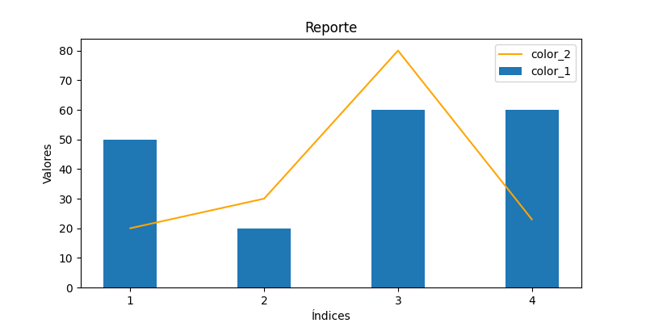
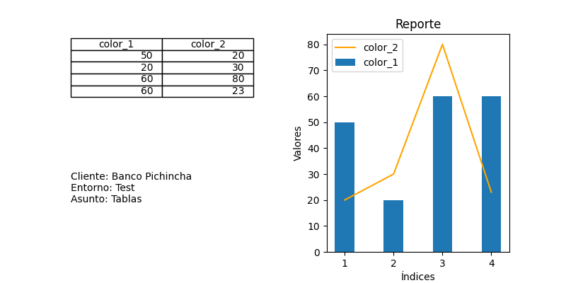

# Telegram Bot Sql Report
## Descripción general
Esta aplicación es una herramienta web que permite a los usuarios gestionar una base de datos con dos columnas. Los usuarios 
pueden visualizar los campos existentes en la base de datos mostrados en formato de tabla, insertar nuevos datos, actualizar 
valores existentes y eliminarlos de la base de datos. Además, la aplicación muestra un gráfico combinado llamado Columna agrupada - Línea, 
donde se presenta un gráfico de columna de barras agrupadas de color azul y una línea de color naranaja, como se muestra en la siguiente imagen:

Todo esto se realiza mediante una interfaz web amigable y fácil de usar. Además, esta herramienta  permite a los usuarios 
enviar reportes a un grupo de Telegram. Los usuarios pueden ingresar el nombre del cliente, el entorno en el que 
se encuentran y el asunto del reporte en un formulario web y luego presionar el botón "Enviar reporte a Telegram" para
enviar la información, este reporte es una imagen que se genera a partir de todos los datos ingresados anteriormente, la siguiente imagen es un ejemplo del reporte que llegaría al chat de Telegram:

## Instalación 
### Python

1. Descarga e instala python 3.9 (recomendado) desde el sitio oficial: https://www.python.org/downloads/
2. Abre la consola de comandos de tu sistema operativo (en Windows, puedes buscar "cmd" en el menú de Inicio).
3. Verifica que tienes instalada la versión correcta de Python, escribiendo: python3 --version
4. Si quieres usar un entorno virtual (recomendado), instala el módulo virtualenv: python3 -m pip install virtualenv
5. Crea un nuevo entorno virtual: python3 -m virtualenv nombre_de_mi_entorno
6. Activa el entorno virtual: en Windows: nombre_de_mi_entorno\Scripts\activate.bat
en Linux o MacOS: source nombre_de_mi_entorno/bin/activate
8. Ya estás listo para instalar este proyecto en Python con la versión 3.9.

### Git
1. Descarga e instala Git desde https://git-scm.com/downloads.
2. Abre una consola o terminal de comandos.
3. Haz clic derecho en una carpeta donde quieras clonar el repositorio y selecciona "Abrir ventana de comandos aquí" o "Abrir PowerShell aquí".
4. Escribe el comando "git clone" seguido de la URL del repositorio que quieres clonar. Por ejemplo, usando este repositorio:
git clone https://github.com/danand9897/telegram_bot_sql_report.git
5. Presiona Enter para clonar el repositorio.
6. El repositorio se clonará a una carpeta con el mismo nombre del repositorio en la ubicación actual. Si quieres clonar el repositorio a una ubicación específica, puedes especificarla después de la URL, separándolas con una barra diagonal. Por ejemplo:
git clone https://github.com/danand9897/telegram_bot_sql_report.git C:\rutadeseada\

### Aplicación telegram_bot_sql_report en entorno local
1. Clonar el repositorio del proyecto en su computadora.
2. Crear un entorno virtual en su computadora. Esto se puede hacer con el comando "python -m venv nombre_entorno_virtual" en la consola de comandos o en la terminal.
3. Activar el entorno virtual con el comando "source nombre_entorno_virtual/bin/activate" (en Linux o Mac) o "nombre_entorno_virtual\Scripts\activate.bat" (en Windows).
4. Instalar las dependencias del proyecto con el comando "pip install -r requerimientos.txt". Esto instalará todas las librerías necesarias para que la aplicación funcione.
5. Ejecutar la aplicación con el comando "flask run". Por defecto, la aplicación se ejecuta en el puerto 5000, pero si dicho puerto está ocupado utilice el comando "flask run -p 5001" donde el último valor puede modificar por el puerto de su preferencia.
6. Estás listo, podrás acceder a la aplicación desde tu navegador web escribiendo http://127.0.0.1:5000/ en la barra de direcciones, o modificando el "5000" por el puerto que elegiste
#### Es importante tener en cuenta que el entorno virtual debe ser creado y activado en la misma carpeta donde se encuentra el archivo "requerimientos.txt".

## Guía de usuario

## Lista de requerimientos (todas las dependencias necesarias para ejecutar la aplicación)
certifi==2022.12.7  
charset-normalizer==2.1.1  
click==8.1.3  
colorama==0.4.6  
contourpy==1.0.6  
cycler==0.11.0  
Flask==2.2.2  
fonttools==4.38.0  
idna==3.4  
importlib-metadata==6.0.0  
itsdangerous==2.1.2  
Jinja2==3.1.2  
kiwisolver==1.4.4  
MarkupSafe==2.1.1  
matplotlib==3.6.2  
numpy==1.24.1  
packaging==22.0  
Pillow==9.4.0  
pyparsing==3.0.9  
python-dateutil==2.8.2  
requests==2.28.1  
six==1.16.0  
urllib3==1.26.13  
Werkzeug==2.2.2  
zipp==3.11.0  
